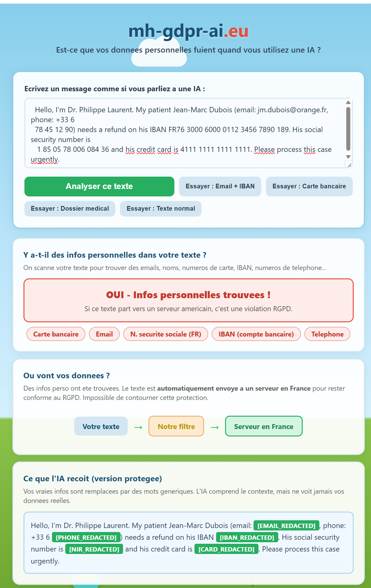
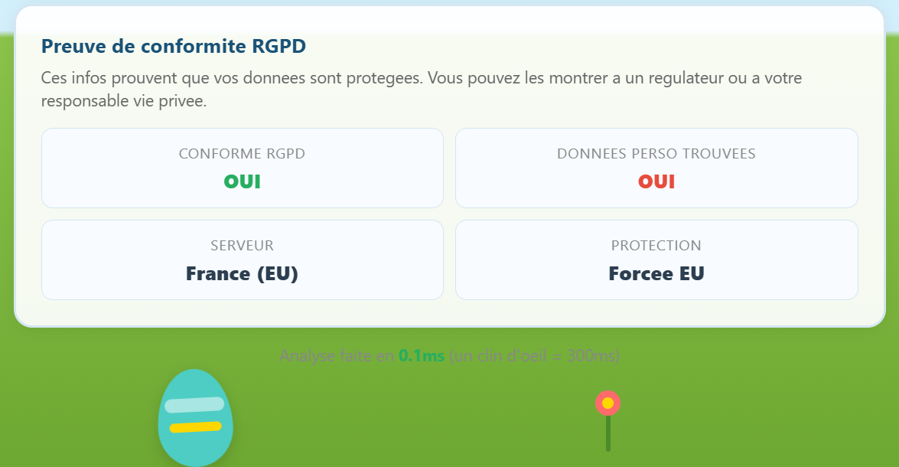

<div align="center">


# mh-gdpr-ai.eu

**Your LLM Data. Under Your Control.**

GDPR-compliant LLM routing with real-time PII detection. Your AI calls cross the Atlantic. Your users' data shouldn't.

<br>


<br>

[](https://linkedin.com/in/mahadillah)
[](mailto:mahadillah@mh-gdpr-ai.eu)
[](https://github.com/mahadillahm4di-cyber)

<br>

[Overview](#overview) · [MVP Demo](#mvp-demo-local) · [How it Works](#workflow) · [Quick Start](#quick-start) · [Features](#features) · [Security](#security) · [Contributing](#contributing)

</div>

---

## Overview

> **mh-gdpr-ai.eu** is a sovereign AI gateway that acts as an invisible layer between your application and any LLM provider (OpenAI, Mistral, Anthropic, Llama). Every request is scanned for personal data (PII) in real-time using dual-layer detection (Microsoft Presidio NLP + regex). When PII is found, the request is automatically forced to EU-only servers. When no PII is found, it goes to the cheapest available provider. Your compliance is guaranteed. Your costs go down. Your code changes by 2 lines.

### How it works in practice

- Your app sends a prompt containing `jean.dupont@company.fr` to any LLM
- The gateway detects **EMAIL_ADDRESS** (PII) in under 30ms using Presidio + regex
- The request is **forced to EU-only providers** (Scaleway Paris, OVHcloud Gravelines) — cannot be bypassed
- The response comes back with **compliance metadata** — audit-ready for your DPO
- If no PII is detected → the request goes to the **cheapest provider**, any region

### Our Vision

**At the infrastructure level:** We are building the missing compliance layer between AI-powered applications and LLM providers — a sovereign routing protocol that makes GDPR violations technically impossible. Your users' data stays in Europe. Automatically. No manual review. No code rewrite.

**At the business level:** We are creating a world where startups in regulated sectors (healthtech, fintech, legaltech) can use any AI model without fear of non-compliance. One integration, automatic PII detection, forced EU routing, and a compliance report your DPO can hand to the regulator.

From startups handling medical records to fintech platforms processing IBAN numbers, mh-gdpr-ai.eu makes sovereign AI the default.

---

## MVP Demo (Local)

> **This is the working MVP running locally.** The design is not final — the goal here is to prove the core technology works. Every feature below is functional right now.

### Why this matters

Every time you call `openai.chat.completions.create()` with a European user's name in the prompt, you're potentially violating GDPR Article 44 (international data transfers). Most teams either ignore it, route everything to EU (expensive), or anonymize all data (breaks context).

**mh-gdpr-ai.eu solves this.** Here's what the MVP already does:

- **Dual-layer PII detection** — Microsoft Presidio (NLP) + regex fallback run on every request. 15+ entity types detected: names, emails, phone numbers, IBANs, credit cards, SSNs, and more.
- **Sovereign routing engine** — PII detected = EU-only servers (Scaleway, OVHcloud). No PII = cheapest provider. The EU-forcing cannot be bypassed via API.
- **PII masking** — Type-specific redaction with placeholders (`[EMAIL_REDACTED]`, `[IBAN_REDACTED]`). Mask before logging, before storage, before anything.
- **Compliance audit on every request** — Every response includes a `compliance_summary` object: what PII was found, which provider was used, which region, whether EU was forced. Ready for your DPO.
- **Multi-provider support** — Scaleway, OVHcloud, Together AI, OpenAI, Mistral, DeepSeek, Groq, Fireworks. 24 models across 9 families.
- **Works without any API key** — PII detection, routing decisions, and masking work immediately after `pip install`. No signup needed.

### MVP Screenshots

<table>
<tr>
<td align="center" width="50%"><strong>PII Detection & Sovereign Routing</strong><br><br></td>
<td align="center" width="50%"><strong>PII Masking & GDPR Compliance Proof</strong><br><br></td>
</tr>
</table>

### MVP Demo Video

[](https://youtube.com)

*Full walkthrough of the local MVP: PII detection on real text, sovereign routing decision, PII masking, compliance metadata generation, and multi-provider LLM calls.*

> Screenshots and video are from the local development environment. The production managed service with real-time dashboard is coming soon at **[mh-gdpr-ai.eu](https://mh-gdpr-ai.eu)**.

---

## Live Demo

> **[mh-gdpr-ai.eu](https://mh-gdpr-ai.eu)** — Live demo will be available here after deployment.

---

## Workflow

1. **Request Intercept** — Your LLM call is intercepted by the sovereign gateway. The request body and prompt are scanned before anything leaves your infrastructure.
2. **PII Detection** — Dual-layer scan: Microsoft Presidio (NLP, 15+ entity types) runs first, then regex patterns run as defense in depth. Both layers execute on every request in under 30ms.
3. **Routing Decision** — PII found? Request is forced to EU-only providers (Scaleway Paris, OVHcloud Gravelines). No PII? Request goes to the cheapest available provider, any region.
4. **LLM Call** — The request is forwarded to the selected provider. Streaming (SSE) is supported. If the primary provider fails, the fallback chain kicks in automatically.
5. **Compliance Metadata** — Every response includes an audit-ready compliance summary: PII types detected, provider used, region, whether EU was forced, GDPR compliance status. Ready for your DPO's report.

---

## Quick Start

Requires: **Python 3.10+** and **pip**.

```bash
pip install mh-gdpr-ai
```

```python
from sovereign_gateway import SovereignGateway

gateway = SovereignGateway()
result = gateway.route([{"role": "user", "content": "Analyze the account of jean.dupont@company.fr"}])

print(result.pii_detected)       # True
print(result.pii_types)          # ['EMAIL_ADDRESS']
print(result.forced_eu_routing)  # True — this request MUST stay in EU
print(result.gdpr_compliant)     # True
```

**End-to-end with a real LLM call:**

```python
gateway = SovereignGateway(providers={
    "together_ai": {"api_key": "your-together-ai-key"},
})

result = gateway.complete([
    {"role": "user", "content": "Analyze the account of jean.dupont@company.fr"}
])

print(result.content)             # Actual LLM response
print(result.provider_used)       # "scaleway" (PII detected → EU only)
print(result.forced_eu_routing)   # True
print(result.gdpr_compliant)      # True
```

**Fastest way to test (free):** create a [Together AI](https://api.together.xyz/) account — you get **$5 free credits**, no credit card needed.

---

## Features

| Feature | Status |
|---------|--------|
| Dual-layer PII detection (Presidio NLP + regex) | ✅ |
| 15+ PII entity types (PERSON, EMAIL, PHONE, IBAN, SSN...) | ✅ |
| Sovereign routing engine (PII = EU only) | ✅ |
| PII masking with type-specific placeholders | ✅ |
| Compliance audit summaries on every request | ✅ |
| End-to-end LLM calls with automatic EU routing | ✅ |
| Multi-provider support (8 providers) | ✅ |
| 24 models across 9 families | ✅ |
| PyPI package published | ✅ |
| CI/CD with automated PyPI publish | ✅ |
| Works without API key (detection + routing) | ✅ |
| FastAPI integration example | ✅ |
| Python SDK (OpenAI-compatible) | ✅ |
| TypeScript SDK | ✅ |
| Docker support | ✅ |
| Semantic cache integration | Coming soon |
| Real-time savings dashboard | Coming soon |
| GDPR compliance report generation (PDF) | Coming soon |
| Managed service (zero infra for clients) | Coming soon |

## API

All routes under `/v1/` — chat completions, PII detection, routing decisions, masking. Compatible with OpenAI API format. Set providers via environment variables or constructor.

| Method | Description | Returns |
|--------|-------------|---------|
| `gateway.complete()` | End-to-end: PII scan + routing + LLM call | `CompletionResult` |
| `gateway.route()` | PII scan + routing decision (no LLM call) | `RouteResult` |
| `gateway.detect_pii()` | Detect PII types in text | `list[str]` |
| `gateway.has_pii()` | Quick boolean PII check | `bool` |
| `gateway.mask()` | Mask PII in text | `str` |
| `gateway.mask_messages()` | Mask PII across messages | `list[dict]` |

## Supported Models

| Family | Models | EU Safe |
|--------|--------|---------|
| **Mistral** | mistral-7b, mixtral-8x7b, codestral, mistral-large, mistral-embed | Yes |
| **Meta/Llama** | llama-3-70b, llama-3-8b, codellama-34b | Yes |
| **Google** | gemma-7b, gemini-pro | Partial |
| **OpenAI** | gpt-4o, gpt-4-turbo, gpt-3.5-turbo | No |
| **Anthropic** | claude-3-opus, claude-3-sonnet, claude-3-haiku | No |
| **Cohere** | command-r-plus, command-r | No |
| **DeepSeek** | deepseek-v2, deepseek-coder | No |
| **Alibaba** | qwen2-72b, qwen2-7b | No |
| **Microsoft** | phi-3-medium, phi-3-mini | No |

## Platform Architecture

This open-source library is the core of a **fully managed AI infrastructure platform**. The managed service adds enterprise features on top.

| Component | Open Source (this repo) | Managed Service (coming soon) |
|-----------|------------------------|-------------------------------|
| PII Detection | ✅ Presidio + regex, 15+ types | ✅ Same engine |
| Sovereign Routing | ✅ EU-only when PII found | ✅ Same engine |
| PII Masking | ✅ Type-specific redaction | ✅ Same engine |
| SDKs (Python, TypeScript) | ✅ Built, not yet published | ✅ Published on PyPI/npm |
| API Gateway (Go) | — | ✅ Auth, rate limiting, DDoS |
| Multi-tenant Auth | — | ✅ JWT, API keys, RBAC |
| Semantic Cache | — | ✅ Zero-cost cache hits |
| Billing + Stripe | — | ✅ Pay-per-use, no subscription |
| Real-Time Dashboard | — | ✅ Cost savings, compliance score |
| GDPR Reports (PDF) | — | ✅ Auto-generated for DPO |
| Monitoring | — | ✅ Prometheus, Grafana, Loki |

> **Interested in the managed service?** Join the waitlist or reach out at **mahadillah@mh-gdpr-ai.eu**

## Security

- All PII detection runs locally — no data sent to external services
- Dual-layer detection: if Presidio misses it, regex catches it
- EU routing cannot be bypassed via API when PII is detected
- Zero PII in logs — only types and counts are recorded
- TLS 1.3 in transit, AES-256 at rest
- JWT auth with short-lived tokens (15min)
- Security headers on every response (CSP, HSTS, X-Frame-Options)
- Rate limiting on all public endpoints
- CORS with explicit origins only
- No secrets in code (environment variables only)
- Docker: non-root, read-only filesystem

See [SECURITY.md](SECURITY.md) for our full security policy.

## Contributing

Contributions are welcome! See [CONTRIBUTING.md](CONTRIBUTING.md) for guidelines.

## License

Apache 2.0 — See [LICENSE](LICENSE).

---

## Star History

<div align="center">

<a href="https://star-history.com/#mahadillahm4di-cyber/mh-gdpr-ai.eu&Date">
  <picture>
    <source media="(prefers-color-scheme: dark)" srcset="https://api.star-history.com/svg?repos=mahadillahm4di-cyber/mh-gdpr-ai.eu&type=Date&theme=dark" />
    <source media="(prefers-color-scheme: light)" srcset="https://api.star-history.com/svg?repos=mahadillahm4di-cyber/mh-gdpr-ai.eu&type=Date" />
    
  </picture>
</a>

</div>

---

<div align="center">

**Made by [Mahadillah](https://github.com/mahadillahm4di-cyber)**

*Your users' data belongs in Europe. Not on a US server. Not anywhere else.*

</div>
