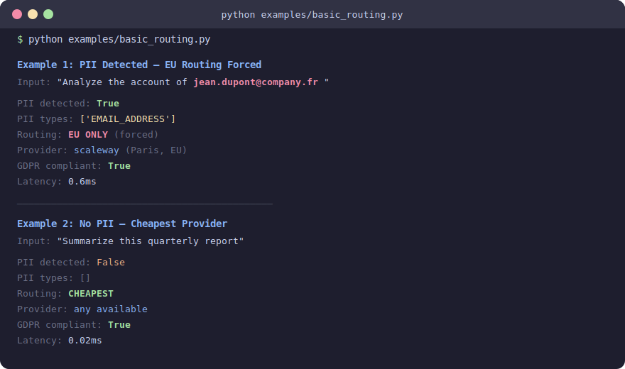

<div align="center">


<br><br>

**GDPR-compliant LLM routing with real-time PII detection**

<em>Your AI calls cross the Atlantic. Your users' data shouldn't.</em>

<br>

<a href="https://github.com/mahadillahm4di-cyber/mh-gdpr-ai.eu/stargazers"></a>
<a href="https://github.com/mahadillahm4di-cyber/mh-gdpr-ai.eu/actions"></a>
<a href="https://pypi.org/project/mh-gdpr-ai/"></a>
<a href="https://pypi.org/project/mh-gdpr-ai/"></a>
<a href="LICENSE"></a>

<br>

<a href="https://pypi.org/project/mh-gdpr-ai/"></a>
<a href="https://github.com/mahadillahm4di-cyber/mh-gdpr-ai.eu/issues"></a>
<a href="https://github.com/mahadillahm4di-cyber/mh-gdpr-ai.eu/network/members"></a>

<br><br>

[Quick Start](#quick-start) &bull; [How It Works](#how-it-works) &bull; [Features](#features) &bull; [SDKs](#sdks) &bull; [Examples](#examples) &bull; [API Reference](#api-reference) &bull; [Contributing](#contributing)

</div>

<br>

> If your LLM prompt contains a name, email, or IBAN — and it hits a US server — that's a GDPR violation.
> Max fine: **4% of global revenue or 20M EUR**.
>
> This gateway fixes that in **3 lines of code**.

<br>

## The Problem

Every time you call `openai.chat.completions.create()` with a European user's name in the prompt, you're potentially violating GDPR Article 44 (international data transfers).

```
Your EU User  -->  Your App  -->  OpenAI API (Virginia, US)  -->  GDPR VIOLATION
     |                                    |
     |          Name, email, IBAN         |
     |          in the prompt             |
     +------------------------------------+
              Personal data left the EU
```

**Most teams either:**
- A) Ignore it and hope for the best
- B) Route everything to EU (expensive)
- C) Anonymize all data (breaks context)

**We built option D:**

```
Your EU User  -->  Your App  -->  Sovereign Gateway  -->  PII detected?
                                       |                      |
                                       |              YES: EU provider only
                                       |              NO:  cheapest provider
                                       |
                                  100% GDPR compliant
                                  30-40% cheaper than option B
```

<br>

## Quick Start

### Install

```bash
pip install mh-gdpr-ai
```

### What works without any API key (instant)

PII detection, routing decisions, and masking all work **immediately** after install — no account, no API key, no signup needed.

```python
from sovereign_gateway import SovereignGateway

gateway = SovereignGateway()
result = gateway.route([{"role": "user", "content": "Analyze the account of jean.dupont@company.fr"}])

print(result.pii_detected)       # True
print(result.pii_types)          # ['EMAIL_ADDRESS']
print(result.forced_eu_routing)  # True — this request MUST stay in EU
print(result.gdpr_compliant)     # True
```

### What requires a provider API key

`gateway.complete()` calls a real LLM, so it needs an API key from at least one provider.

**Fastest way to test (free):** create a [Together AI](https://api.together.xyz/) account — you get **$5 free credits**, no credit card needed.

```python
from sovereign_gateway import SovereignGateway

# Option 1: pass key directly
gateway = SovereignGateway(providers={
    "together_ai": {"api_key": "your-together-ai-key"},
})

# Option 2: set env variable (TOGETHER_AI_API_KEY) and it's auto-detected
# export TOGETHER_AI_API_KEY=your-key
gateway = SovereignGateway()

# Now complete() works — PII scan + routing + actual LLM call
result = gateway.complete([
    {"role": "user", "content": "Analyze the account of jean.dupont@company.fr"}
])

print(result.content)             # Actual LLM response
print(result.provider_used)       # "together_ai" or "scaleway" depending on PII
print(result.forced_eu_routing)   # True (PII detected → EU only)
print(result.gdpr_compliant)      # True
```

**Supported providers** (any OpenAI-compatible endpoint): Scaleway, OVHcloud, Together AI, OpenAI, Mistral, DeepSeek, Groq, Fireworks.

### Summary: what you can do

| Feature | Needs API key? | Method |
|---------|---------------|--------|
| Detect PII in text | No | `gateway.route()`, `gateway.detect_pii()`, `gateway.has_pii()` |
| Get routing decision (EU vs cheapest) | No | `gateway.route()` |
| Mask PII with placeholders | No | `gateway.mask()`, `gateway.mask_messages()` |
| Get compliance audit summary | No | `result.compliance_summary` |
| **Call a real LLM with GDPR routing** | **Yes** | `gateway.complete()` |

### See It In Action

<div align="center">

</div>

<br>

## How It Works

The gateway runs a **3-filter pipeline** on every request in under 50ms:

```
                    ┌─────────────────────────────────────┐
                    │         INCOMING REQUEST             │
                    │  "Analyze jean.dupont@company.fr"    │
                    └──────────────┬──────────────────────┘
                                   │
                    ┌──────────────▼──────────────────────┐
                    │  FILTER 1: PII DETECTION             │
                    │                                      │
                    │  Layer 1: Presidio NLP               │
                    │    -> PERSON, EMAIL, PHONE, IBAN...  │
                    │                                      │
                    │  Layer 2: Regex (defense in depth)   │
                    │    -> EMAIL, CREDIT_CARD, SSN...     │
                    │                                      │
                    │  Result: EMAIL_ADDRESS detected      │
                    └──────────────┬──────────────────────┘
                                   │
                    ┌──────────────▼──────────────────────┐
                    │  FILTER 2: ROUTING DECISION          │
                    │                                      │
                    │  PII found?                          │
                    │  ├─ YES -> EU providers ONLY         │
                    │  │         (Scaleway, OVHCloud)      │
                    │  │         Cannot be bypassed.       │
                    │  │                                   │
                    │  └─ NO  -> Cheapest provider         │
                    │            (any region)              │
                    └──────────────┬──────────────────────┘
                                   │
                    ┌──────────────▼──────────────────────┐
                    │  FILTER 3: COMPLIANCE METADATA       │
                    │                                      │
                    │  {                                   │
                    │    "gdpr_compliant": true,           │
                    │    "pii_types": ["EMAIL_ADDRESS"],   │
                    │    "forced_eu_routing": true,        │
                    │    "provider": "scaleway"            │
                    │  }                                   │
                    │                                      │
                    │  Ready for your DPO's audit report.  │
                    └─────────────────────────────────────┘
```

### Dual-Layer PII Detection

| Layer | Engine | Speed | Entities | Purpose |
|-------|--------|-------|----------|---------|
| **Primary** | Microsoft Presidio (NLP) | ~30ms | 15+ types | High accuracy, context-aware |
| **Fallback** | Regex patterns | <5ms | 7 types | Guaranteed detection, always runs |

Both layers run on every request. If Presidio misses something, regex catches it. If Presidio isn't installed, regex handles everything.

<br>

## Features

### PII Detection (15+ Entity Types)

<div align="center">

| Entity Type | Example | Detection |
|-------------|---------|-----------|
| `PERSON` | Jean Dupont | Presidio |
| `EMAIL_ADDRESS` | jean@company.fr | Presidio + Regex |
| `PHONE_NUMBER` | +33 6 12 34 56 78 | Presidio + Regex |
| `IBAN_CODE` | FR76 3000 6000 0112... | Presidio + Regex |
| `CREDIT_CARD` | 4111 1111 1111 1111 | Presidio + Regex |
| `US_SSN` | 123-45-6789 | Presidio + Regex |
| `FR_NIR` | 1 85 05 78 006 084 36 | Regex |
| `IP_ADDRESS` | 192.168.1.1 | Presidio + Regex |
| `LOCATION` | 14 Rue de Rivoli, Paris | Presidio |
| `DATE_TIME` | Born on 15/03/1985 | Presidio |
| `MEDICAL_LICENSE` | DEA: AB1234567 | Presidio |
| `CRYPTO` | 1A1zP1eP5QGefi2... | Presidio |
| `NRP` | French nationality | Presidio |
| `UK_NHS` | 943 476 5919 | Presidio |
| `US_PASSPORT` | 123456789 | Presidio |

</div>

### Sovereign Routing

<div align="center">

| Condition | Routing | Providers | Model |
|-----------|---------|-----------|-------|
| PII detected | **EU ONLY** | Scaleway, OVHCloud | EU-safe (Mistral, Llama, Gemma) |
| No PII | **CHEAPEST** | Any provider | Any model |

</div>

### PII Masking

```python
from sovereign_gateway import PIIMasker

masker = PIIMasker()
masked, types = masker.mask("Email jean@company.fr, IBAN FR76 3000 6000 0112 3456 7890 189")

print(masked)  # "Email [EMAIL_REDACTED], IBAN [IBAN_REDACTED]"
print(types)   # ["EMAIL_ADDRESS", "IBAN_CODE"]
```

### Compliance-Ready Audit Logs

```python
result = gateway.route([{"role": "user", "content": "Patient Jean Dupont..."}])

# Ready for your DPO
print(result.compliance_summary)
# {
#     "gdpr_compliant": True,
#     "pii_detected": True,
#     "pii_types": ["PERSON"],
#     "routing_decision": "eu_only",
#     "provider_region": "EU",
#     "provider": "scaleway",
#     "model": "mistral-7b"
# }
```

<br>

## SDKs (coming soon)

Full-featured SDKs with OpenAI-compatible drop-in replacement, circuit breaker, retry logic, and real-time cost tracking. The SDKs are built and tested in [sdk/](sdk/) but not yet published to PyPI/npm.

| SDK | Status | Docs |
|-----|--------|------|
| **Python** | Built, not yet published | [sdk/python/README.md](sdk/python/README.md) |
| **TypeScript** | Built, not yet published | [sdk/typescript/README.md](sdk/typescript/README.md) |

**Today, use the gateway directly:**

```python
# pip install mh-gdpr-ai
from sovereign_gateway import SovereignGateway

gateway = SovereignGateway(providers={
    "scaleway": {"api_key": "scw-..."},
})

# End-to-end: PII detection + routing + LLM call
result = gateway.complete([
    {"role": "user", "content": "Analyze jean.dupont@company.fr"}
])
print(result.content)           # LLM response
print(result.forced_eu_routing) # True (PII -> EU only)
```

<br>

## Examples

### Basic Routing

```python
from sovereign_gateway import SovereignGateway

gateway = SovereignGateway()

# PII detected -> EU forced
result = gateway.route([
    {"role": "user", "content": "Analyze the account of jean.dupont@company.fr"}
])
assert result.forced_eu_routing == True
assert result.gdpr_compliant == True

# No PII -> cheapest
result = gateway.route([
    {"role": "user", "content": "Summarize this quarterly report"}
])
assert result.forced_eu_routing == False
```

### FastAPI Integration

```python
from fastapi import FastAPI
from sovereign_gateway import SovereignGateway

app = FastAPI()
gateway = SovereignGateway(providers={
    "scaleway": {"api_key": "scw-your-key"},
    "together_ai": {"api_key": "tok-your-key"},
})

@app.post("/v1/chat")
async def chat(messages: list[dict]):
    # One call — PII detection + routing + LLM call
    result = gateway.complete(messages)

    return {
        "content": result.content,
        "compliance": result.compliance_summary,
    }
```

### PII Detection Only

```python
from sovereign_gateway import PIIDetector

detector = PIIDetector()

# Full entity detection
entities = detector.detect("Call Jean at +33 6 12 34 56 78")
for entity in entities:
    print(f"  {entity.entity_type} (confidence: {entity.score})")

# Quick check
if detector.has_pii(user_input):
    print("WARNING: PII detected in user input")
```

### Run Examples

```bash
python examples/basic_routing.py
python examples/pii_detection.py
```

<br>

## Installation Options

| Installation | Command | Use Case |
|---|---|---|
| **Core** (regex-only) | `pip install mh-gdpr-ai` | Quick start, minimal deps |
| **With Presidio** (recommended) | `pip install mh-gdpr-ai[presidio]` | Production, NLP detection |
| **With FastAPI** | `pip install mh-gdpr-ai[api]` | API server |
| **Everything** | `pip install mh-gdpr-ai[all]` | Full installation |

### With Presidio (Recommended)

Presidio adds NLP-based detection for entities that regex can't catch (person names, locations, dates). Install it for production use:

```bash
pip install mh-gdpr-ai[presidio]
python -m spacy download en_core_web_lg
```

```python
# Presidio is automatically used when installed
gateway = SovereignGateway()  # uses Presidio + regex

# Force regex-only (faster, fewer dependencies)
gateway = SovereignGateway(use_presidio=False)
```

<br>

## API Reference

### `SovereignGateway`

The main entry point.

| Method | Description | Returns |
|--------|-------------|---------|
| `complete(messages, model?, max_tokens?, temperature?)` | **End-to-end: PII scan + routing + LLM call** | `CompletionResult` |
| `route(messages, model?, request_id?)` | PII scan + routing decision (no LLM call) | `RouteResult` |
| `detect_pii(text)` | Detect PII types | `list[str]` |
| `has_pii(text)` | Quick PII check | `bool` |
| `mask(text)` | Mask PII in text | `str` |
| `mask_messages(messages)` | Mask PII in messages | `list[dict]` |

Constructor accepts `providers=` dict to configure LLM providers:

```python
gateway = SovereignGateway(providers={
    "scaleway": {"api_key": "scw-xxx"},                              # EU (Paris)
    "ovhcloud": {"api_key": "ovh-xxx"},                              # EU (Gravelines)
    "together_ai": {"api_key": "tok-xxx"},                           # Non-EU fallback
    "openai": {"api_key": "sk-xxx"},                                 # Non-EU
    "scaleway": {"api_key": "scw-xxx", "base_url": "https://custom.url/v1"},  # Custom URL
})
```

Or set environment variables: `SCALEWAY_API_KEY`, `TOGETHER_AI_API_KEY`, `OPENAI_API_KEY`, etc.

### `CompletionResult`

Returned by `gateway.complete()` — includes the LLM response and compliance metadata.

| Field | Type | Description |
|-------|------|-------------|
| `content` | `str` | The model's response text |
| `model_used` | `str` | Model that generated the response |
| `provider_used` | `str` | Provider that served the request |
| `forced_eu_routing` | `bool` | Whether EU was forced due to PII |
| `gdpr_compliant` | `bool` | Whether the request is GDPR compliant |
| `pii_detected` | `bool` | Whether PII was found |
| `pii_types` | `list[str]` | Types of PII detected |
| `latency_ms` | `float` | Total time (PII scan + routing + LLM call) |
| `tokens_used` | `int` | Total tokens consumed |
| `compliance_summary` | `dict` | Audit-ready summary for DPO |

### `RouteResult`

| Field | Type | Description |
|-------|------|-------------|
| `decision` | `RoutingDecision` | `eu_only`, `cheapest`, or `cache_hit` |
| `pii_detected` | `bool` | Whether PII was found |
| `pii_types` | `list[str]` | Types of PII detected |
| `forced_eu_routing` | `bool` | Whether EU was forced |
| `gdpr_compliant` | `bool` | Whether the result is GDPR compliant |
| `model_used` | `str` | Selected model |
| `provider_used` | `str` | Selected provider |
| `latency_ms` | `float` | Processing time in ms |
| `compliance_summary` | `dict` | Audit-ready summary |

### `PIIDetector`

| Method | Description | Returns |
|--------|-------------|---------|
| `detect(text)` | Full entity detection | `list[PIIEntity]` |
| `detect_types(text)` | Type names only | `list[str]` |
| `has_pii(text)` | Quick boolean check | `bool` |

### `PIIMasker`

| Method | Description | Returns |
|--------|-------------|---------|
| `mask(text)` | Mask PII in text | `(str, list[str])` |
| `detect(text)` | Detect types (no mask) | `list[str]` |
| `mask_messages(messages)` | Mask across messages | `(list[dict], list[str])` |

<br>

## Supported Models

### EU-Safe Models (used when PII detected)

<div align="center">

| Model | Family | Use Case |
|-------|--------|----------|
| `mistral-7b` | Mistral | Fast, cheap, general |
| `mixtral-8x7b` | Mistral | Reasoning, long context |
| `codestral` | Mistral | Code generation |
| `mistral-large` | Mistral | Complex analysis |
| `llama-3-70b` | Meta | High quality |
| `llama-3-8b` | Meta | Fast, efficient |
| `gemma-7b` | Google | Lightweight |

</div>

The gateway supports **20+ models** across **9 families**: Mistral, OpenAI, Anthropic, Meta, Google, Cohere, Microsoft, DeepSeek, and Alibaba.

<br>

## Architecture

```
mh-gdpr-ai.eu/
├── sovereign_gateway/          # Main package
│   ├── gateway.py              # SovereignGateway (route + complete)
│   ├── pii/
│   │   ├── detector.py         # Dual-layer PII detection
│   │   └── masker.py           # PII masking
│   ├── router/
│   │   └── sovereign.py        # Sovereign routing engine
│   ├── providers/
│   │   └── openai_compat.py    # OpenAI-compatible provider client
│   └── models/
│       └── schemas.py          # Pydantic models
├── examples/                   # Working examples
│   ├── basic_routing.py
│   ├── pii_detection.py
│   └── fastapi_integration.py
├── tests/                      # 63 tests
│   ├── test_pii_detector.py
│   ├── test_masker.py
│   ├── test_sovereign_router.py
│   └── test_complete.py        # End-to-end + provider tests
├── pyproject.toml              # Package config
├── Dockerfile                  # Production container
└── Makefile                    # Dev commands
```

<br>

## Development

### Prerequisites

| Tool | Version | Check |
|------|---------|-------|
| Python | >= 3.10 | `python --version` |
| pip | latest | `pip --version` |
| Git | any | `git --version` |

### Setup

```bash
git clone https://github.com/mahadillahm4di-cyber/mh-gdpr-ai.eu.git
cd mh-gdpr-ai.eu

python -m venv .venv
source .venv/bin/activate  # or .venv\Scripts\activate on Windows

pip install -e ".[dev]"

# Run tests
make test

# Run linter
make lint

# Run examples
make examples
```

<br>

## Why This Exists

GDPR Article 44 requires that personal data of EU residents stays within the EEA unless adequate safeguards exist. Most LLM API calls go to US servers. If your prompt contains a user's name, email, or IBAN — you're transferring personal data outside the EU.

**The fine is up to 4% of global annual revenue or 20 million EUR, whichever is higher.**

This gateway ensures that never happens, automatically.

<br>

## Roadmap

- [x] Regex-based PII detection (7 entity types)
- [x] Presidio NLP integration (15+ entity types)
- [x] Sovereign routing engine
- [x] PII masking
- [x] Compliance audit summaries
- [x] PyPI package published
- [x] CI/CD with automated PyPI publish
- [x] End-to-end LLM calls (`gateway.complete()`) with automatic EU routing
- [x] Multi-provider support (Scaleway, OVHcloud, Together AI, OpenAI, etc.)
- [ ] Semantic cache integration
- [ ] Real-time dashboard
- [ ] GDPR compliance report generation (PDF)

<br>

## Platform Architecture

This open-source library is the core of a **fully managed AI infrastructure platform**. The managed service adds enterprise features on top of the library.

```
                          ┌──────────────────────────────────┐
                          │         Your Application          │
                          │   (2 lines to integrate SDK)      │
                          └──────────────┬───────────────────┘
                                         │
                                         ▼
┌─────────────────────────────────────────────────────────────────────┐
│                        API Gateway (Go)                             │
│   Auth · Rate Limiting · DDoS Protection · Request Routing          │
└────────────────────────────┬────────────────────────────────────────┘
                             │
              ┌──────────────┼──────────────┐
              ▼              ▼              ▼
   ┌──────────────┐ ┌──────────────┐ ┌──────────────┐
   │ Auth Service  │ │Router Engine │ │   Billing    │
   │    (Go)       │ │  (Python)    │ │  Service     │
   │              │ │              │ │    (Go)      │
   │ JWT · API    │ │ PII Detect   │ │ Usage Track  │
   │ Keys · RBAC  │ │ EU Routing   │ │ Stripe       │
   │ Multi-tenant │ │ Model Select │ │ Invoices     │
   └──────────────┘ │ Cache Layer  │ └──────────────┘
                    └──────┬───────┘
                           │
            ┌──────────────┼──────────────┐
            ▼              ▼              ▼
   ┌──────────────┐ ┌──────────────┐ ┌──────────────┐
   │  Scaleway    │ │  OVHCloud    │ │  RunPod /    │
   │  Paris (EU)  │ │  FR (EU)     │ │  Together /  │
   │              │ │              │ │  Lambda      │
   │  Priority 1  │ │  Priority 2  │ │  Fallback    │
   └──────────────┘ └──────────────┘ └──────────────┘
```

### Open Source (this repo)

| Component | What it does |
|-----------|-------------|
| **PII Detection** | Dual-layer: Presidio NLP + regex fallback, 15+ entity types |
| **Sovereign Routing** | PII detected → EU only, no PII → cheapest provider |
| **PII Masking** | Type-specific placeholders (email, phone, IBAN, SSN...) |
| **Python SDK** | OpenAI-compatible client, circuit breaker, retry, cost tracking |
| **TypeScript SDK** | Same features, same API, for Node.js/Deno/Bun |

### Managed Service (coming soon)

| Component | What it does | Why it matters |
|-----------|-------------|----------------|
| **API Gateway** | Auth, rate limiting, DDoS protection | Zero infrastructure for clients |
| **Auth Service** | JWT, API keys, multi-tenant isolation | Each client is sandboxed |
| **Router Engine** | Semantic cache, model selection, fallback chain | 30-70% cost savings |
| **Billing Service** | Usage tracking, Stripe integration, invoices | Pay-per-use, no subscription |
| **Real-Time Dashboard** | Cost savings, RGPD compliance score, latency | Clients see savings grow daily |
| **GDPR Compliance Reports** | Auto-generated PDF for DPO/regulators | Unblocks sales in regulated sectors |
| **Monitoring** | Prometheus, Grafana, Loki | Full observability, zero PII in logs |
| **Deployment** | Helm charts, Terraform, Kubernetes | Production-ready, auto-scaling |

### Supported Models (24 models, 9 families)

| Family | Models | EU Safe |
|--------|--------|---------|
| **Mistral** | mistral-7b, mixtral-8x7b, codestral, mistral-large, mistral-embed | Yes |
| **Meta/Llama** | llama-3-70b, llama-3-8b, codellama-34b | Yes |
| **Google** | gemma-7b, gemini-pro | Partial |
| **OpenAI** | gpt-4o, gpt-4-turbo, gpt-3.5-turbo | No |
| **Anthropic** | claude-3-opus, claude-3-sonnet, claude-3-haiku | No |
| **Cohere** | command-r-plus, command-r | No |
| **DeepSeek** | deepseek-v2, deepseek-coder | No |
| **Alibaba** | qwen2-72b, qwen2-7b | No |
| **Microsoft** | phi-3-medium, phi-3-mini | No |

> **Interested in the managed service?** Join the waitlist or reach out at **mahadillah@mh-gdpr-ai.eu**

<br>

## License

Apache License 2.0 — see [LICENSE](LICENSE) for details.

## Contributing

Contributions are welcome! See [CONTRIBUTING.md](CONTRIBUTING.md) for guidelines.

## Security

Found a vulnerability? See [SECURITY.md](SECURITY.md) for responsible disclosure.

<br>

<div align="center">

---

**Built for teams who take data privacy seriously.**

Star this repo if you think GDPR compliance shouldn't be an afterthought.

<br>

<a href="https://star-history.com/#mahadillahm4di-cyber/mh-gdpr-ai.eu&Date">
  <picture>
    <source media="(prefers-color-scheme: dark)" srcset="https://api.star-history.com/svg?repos=mahadillahm4di-cyber/mh-gdpr-ai.eu&type=Date&theme=dark" />
    <source media="(prefers-color-scheme: light)" srcset="https://api.star-history.com/svg?repos=mahadillahm4di-cyber/mh-gdpr-ai.eu&type=Date" />
    
  </picture>
</a>

</div>
